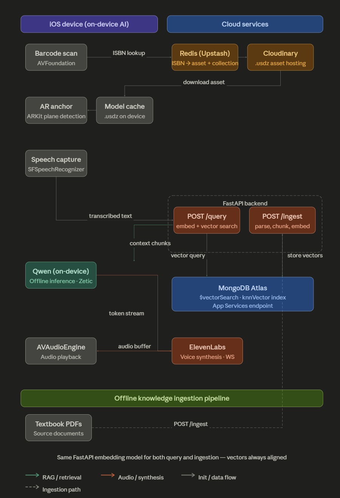

# J.I.T - LAHacks 2026

J.I.T (Just In Time) is an augmented reality educational assistant built at LA Hacks 2026. Students scan a textbook ISBN, place a 3D tutor in the real world, ask questions out loud, and receive spoken answers grounded in that textbook's content.

🏆 Award: **Best Use of MongoDB Atlas at LA Hacks 2026**

## What It Does

Textbooks are dense, static, and often hard to engage with. J.I.T turns a supported textbook into an interactive study companion:

1. Scan the book's EAN-13 ISBN barcode in the iOS app.
2. Look up the matching textbook/avatar metadata through Upstash Redis.
3. Download the Cloudinary-hosted 3D avatar assets.
4. Place the avatar in AR using ARKit and RealityKit horizontal plane detection.
5. Ask a question by voice.
6. Retrieve ISBN-scoped textbook context from MongoDB Atlas Vector Search.
7. Generate an answer on device with a Zetic-powered local LLM.
8. Speak the answer back with ElevenLabs text-to-speech.

## Architecture



The iOS device owns the real-time experience: barcode scanning, AR rendering, local speech capture, local response generation, and audio playback. The backend acts as a secure retrieval boundary for textbook ingestion, embedding, MongoDB Atlas access, and Redis routing updates.

## Tech Stack

- **iOS app:** SwiftUI, ARKit, RealityKit, AVFoundation barcode scanning, Speech framework
- **On-device AI:** Zetic ML / MLange local LLM runtime
- **Backend:** FastAPI, Pydantic, Uvicorn
- **Embeddings:** SentenceTransformers with `google/embeddinggemma-300m`
- **Database:** MongoDB Atlas Vector Search
- **Routing:** Upstash Redis REST API
- **Asset hosting:** Cloudinary
- **Voice:** ElevenLabs WebSocket text-to-speech
- **Publisher dashboard:** React, Vite, TypeScript

## Repository Layout

```text
.
+-- lahacks/          # Native iOS app
+-- backend/          # FastAPI ingestion and retrieval service
+-- jit-dashboard/    # React/Vite publisher upload dashboard
+-- ingestion/        # Offline ingestion and query test scripts
+-- atlas/            # Atlas Vector Search index and reference docs
+-- CLAUDE.md         # Project architecture notes
```

## MongoDB Atlas RAG Pipeline

J.I.T uses MongoDB Atlas as the retrieval layer for textbook-grounded answers.

- Textbook PDFs are uploaded through the dashboard or backend.
- The backend extracts PDF text with `pypdf`.
- Text is split into overlapping word-window chunks.
- Chunks are embedded with `encode_document()`.
- Documents are stored in a shared `textbook_chunks` collection with an `isbn` field.
- User questions are embedded with `encode_query()`.
- Retrieval runs Atlas `$vectorSearch` with `filter: { isbn: scannedISBN }`.
- Only matching chunks from the scanned textbook are sent to the local LLM.

This ISBN boundary keeps answers grounded in the correct book and prevents unrelated textbooks from leaking into the prompt.

## Backend Quick Start

```bash
cd backend
python -m venv .venv
source .venv/bin/activate
pip install -r requirements.txt
cp .env.example .env
uvicorn main:app --reload --host 0.0.0.0 --port 8000
```

Configure `backend/.env` with MongoDB Atlas, Upstash Redis, Hugging Face, and deployment settings. See `backend/README.md` for the full environment contract and API examples.

Core routes:

- `GET /health`
- `POST /upload-textbook`
- `POST /retrieve-context`

## Dashboard Quick Start

```bash
cd jit-dashboard
npm install
npm run dev
```

The dashboard lets publishers upload a textbook PDF, associate it with a 13-digit ISBN, and optionally upload custom avatar assets through Cloudinary. See `jit-dashboard/README.md` for Cloudinary setup and upload requirements.

## iOS App

Open the Xcode project and run the `lahacks` app target on an iOS device with camera, microphone, and ARKit support.

The app includes:

- EAN-13 ISBN barcode scanning
- Redis-backed textbook/avatar lookup
- Cloudinary USDZ download and local extraction
- ARKit horizontal plane detection
- RealityKit avatar rendering and animation
- Speech transcription
- RAG context retrieval from the FastAPI backend
- Local LLM response generation
- ElevenLabs voice playback

Do not commit real API keys or service credentials. Use local configuration or secrets management for MongoDB, Upstash, Cloudinary, Hugging Face, Zetic, and ElevenLabs credentials.

## Atlas Setup

Create an Atlas Vector Search index for the configured collection:

- Index name: `textbook_chunks_vector_index`
- Vector path: `embedding`
- Dimensions: `768`
- Similarity: `dotProduct`
- Filter fields: `isbn`, `source_file`

See `atlas/README.md` for the full Atlas setup checklist and document shape.

## Demo Flow

1. Scan a supported textbook's ISBN barcode.
2. J.I.T downloads the matching avatar assets.
3. The avatar appears in AR on a detected horizontal surface.
4. Ask a question about the textbook.
5. The backend retrieves relevant textbook chunks from MongoDB Atlas.
6. The on-device LLM generates a grounded response.
7. J.I.T speaks the answer back in real time.

## Links

- Devpost: https://devpost.com/software/j-i-t
- GitHub: https://github.com/antonk0/lahacks26
